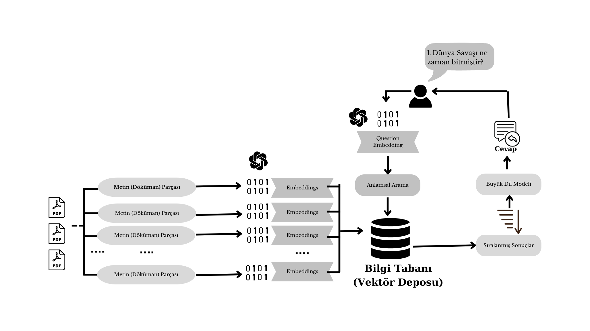

# PDF'lerinizle Konuşun

> Projenin açıklamasını [Medium](https://medium.com/@ramazanolmeez) adresinde bulabilirsiniz.


https://github.com/rolmez/langchain-PDFlerinizle-konusun/assets/32552764/b6834847-6e20-4b5c-9718-cdac1f986815


## Giriş
------------
Bu uygulama, birden fazla PDF dosyasına sorular sormanıza olanak tanıyan bir Python uygulamasıdır. Özel belgelerinizi internet ortamına yüklemeden PDF'lere barındırdıkları bilgiler hakkında sorular sorabilirsiniz. Uygulama, sorularınıza yanıt verebilmek için OpenAI dil modelini kullanmaktadır. Lütfen uygulamanın yalnızca yüklediğiniz PDF'lerle ilgili sorulara yanıt vereceğini unutmayın.

## Nasıl Çalışır
------------



Uygulama, sorularınıza yanıt vermek için şu adımları izler:

1. PDF Yükleme: Uygulama birden fazla PDF belgesini okur ve bunların tek bir metin haline getirir.

2. Metin Parçalama: Tek bir parça haline getirilen metin, etkili bir şekilde işlenebilmek adına daha küçük parçalara (chunks) bölünür.

3. Dil Modeli: Uygulama, metin parçalarının vektör temsillerini (embeddings) oluşturmak için bir dil modeli kullanır.

4. Semantik Arama: Uygulamaya bir soru sorulduğunda, bu soruyu metin parçalarıyla karşılaştırır ve anlamsal olarak en benzer olanları belirler.

5. Yanıt Oluşturma: Kullanıcının sorduğu soruya anlamsal olarak benzerlik gösteren parçalar, bir yanıt oluşturan dil modeline aktarılır ve bu modelde işlenerek kullanıcıya cevap verilir.

## Bağımlılıklar
----------------------------
1. Depoyu yerel makinenize klonlayın.

2. Aşağıdaki komutu çalıştırarak gerekli bağımlılıkları yükleyin:
   ```
   pip install -r requirements.txt
   ```

3. OpenAI'dan bir API anahtarı alın ve bunu proje dizinindeki `.env` dosyasına ekleyin.
   ```
   OPENAI_API_KEY=<YOUR_API_KEY>
   ```

## Kullanım
-----
1. Gerekli bağımlılıkları yüklediğinizden ve OpenAI API anahtarını `.env` dosyasına eklediğinizden emin olun.

2. 'app.py' dosyasını çalıştırmak için aşağıdaki komutu kullanın:
   ```
   streamlit run app.py
   ```
* Bu kodun hata vermesi halinde aşağıdaki kodu da kullanabilirsiniz:
   ```
   streamlit run app.py --server.fileWatcherType none
   ```

3. Uygulama varsayılan web tarayıcınızda başlatılacak ve kullanıcı arayüzünü görüntüleyeceksiniz.

4. Talimatları izleyerek uygulamaya birden fazla PDF belgesi yükleyin.

5. Sohbet arayüzünü kullanarak yüklenen PDF'ler hakkında sorular sorun.
